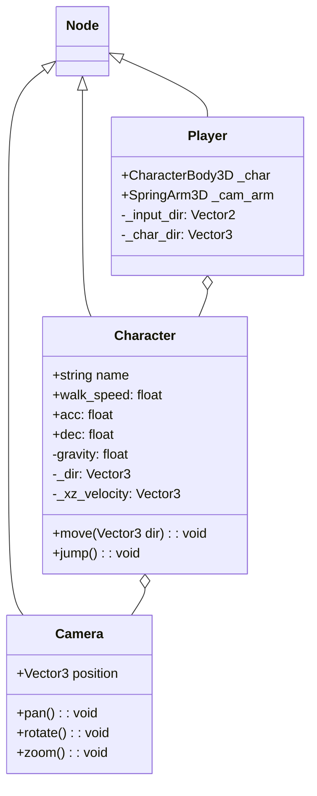

## Classes

```mermaid
classDiagram
    Node <|-- Player
    Node <|-- Camera
    Node <|-- Character
    Player o-- Character
    Character o-- Camera
    class Node {
    }
    class Player {
        +CharacterBody3D _char
        +SpringArm3D _cam_arm

        -_input_dir: Vector2
        -_char_dir: Vector3
    }
    class Camera {
        +Vector3 position
        +pan(): void
        +rotate(): void
        +zoom(): void
    }
    class Character {
        +string name
        +walk_speed: float
        +acc: float
        +dec: float

        -gravity: float
        -_dir: Vector3
        -_xz_velocity: Vector3

        +move(Vector3 dir): void
        +jump(): void
    }
```