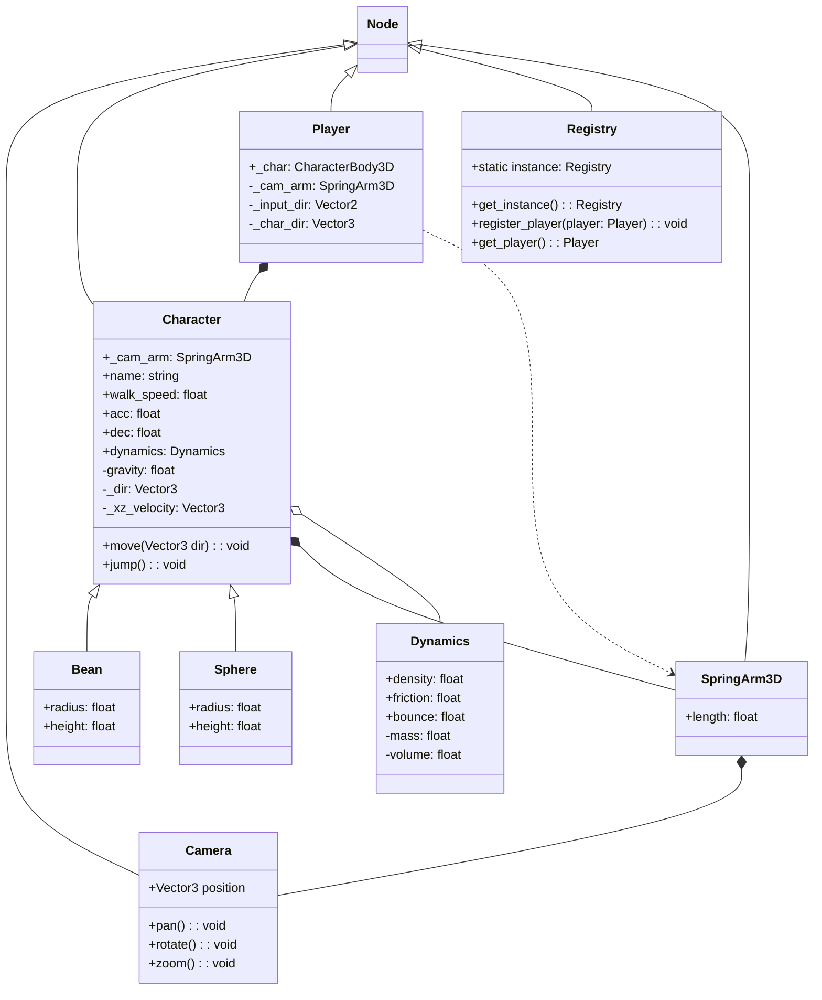

## Classes

```mermaid
classDiagram
    %% Base Classes
    Node <|-- Camera
    Node <|-- Character
    Node <|-- Player
    Node <|-- Registry
    Node <|-- SpringArm3D
    %% Inheritance
    Character <|-- Bean
    Character <|-- Sphere
    %% Aggregation
    Character *-- SpringArm3D
    Player *-- Character
    SpringArm3D *-- Camera
    %% Composition
    Character o-- Dynamics
    %% Dependencies
    Player ..> SpringArm3D
    class Node {
    }
    class Player {
        +_char: CharacterBody3D 
        -_cam_arm: SpringArm3D
        -_input_dir: Vector2
        -_char_dir: Vector3
    }
    class Camera {
        +Vector3 position
        +pan(): void
        +rotate(): void
        +zoom(): void
    }
    class Character {
        +_cam_arm: SpringArm3D
        +name: string
        +walk_speed: float
        +acc: float
        +dec: float
        +dynamics: Dynamics

        -gravity: float
        -_dir: Vector3
        -_xz_velocity: Vector3

        +move(Vector3 dir): void
        +jump(): void
    }
    class Dynamics {
        +density: float
        +friction: float
        +bounce: float
        -mass: float
        -volume: float
    }
    class SpringArm3D {
        +length: float
    }
    %% Derived Classes
    class Bean {
        +radius: float
        +height: float
    }
    class Sphere {
        +radius: float
        +height: float
    }
    %% Utils/Singletons
    class Registry {
        +static instance: Registry
        +get_instance(): Registry
        +register_player(player: Player): void
        +get_player(): Player
    }
```